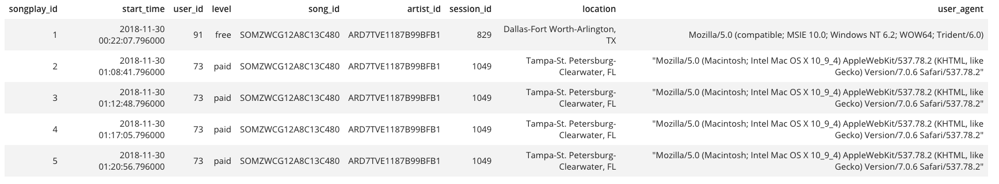
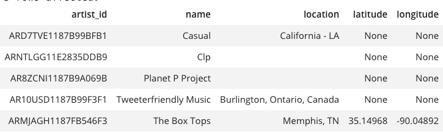
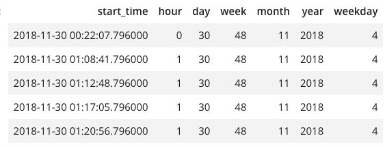
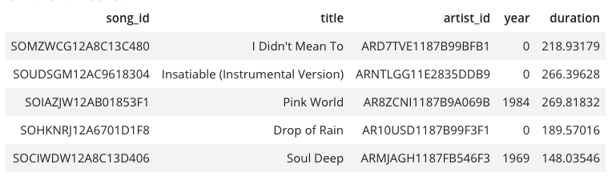

# Data Modeling with Postgres

## Table of contents
* [Introduction](#Introduction)
* [Purpose and Goals](#Purpose-and-Goals)
* [How to run the Python scripts](#How-to-run-the-Python-scripts)
* [Files](#files)
* [ETL](#etl)

## Introduction

This project is to build a consistent database called Sparkify in which all data related songs, artists, users and the playsongs action be organize under a star schema

## Purpose and Goals

The purpose of this database is to allow all users in Sparkify to be available to query in a simple way whatever information or KPI of the company they want to know.
The analytics goals could be to get information about what are the most frequent time frames, or what users, artists or songs are most listened, etc, etc.

# How to run the Python scripts:

The python scrips could be run open the terminal and running: 

$ python file.py
$

# Files

In the repository we have two folder of files (all files in JSON formats):

* Song files: In this folder we can found information related the songs and their belong artists. 

* Log files: In this folder we can found information related the songs played with their timestamp and users who have listented to.

# ETL

We have build an star schema, with fact and dimension tables.
Fact table:

* songplay table) in which are present all the songs played by the users 

and the Dimenstion tables: 

* users

* artists

* time 

* songs

For the fact table there is a serial identifier as Primary Key.
For the dimension tables we have created the belong id for each purpose table.
And in that tables, when we have duplicates we following this steps:

* For the artists, time and songs table, in case do we have duplicates, we just added an ON CONFLICT clause in which we said to do nothing and keep the original rows.
* In the user table, when we have duplicate by user_id, we just update the rows with the new level throghout an ON CONFLICT clause too.